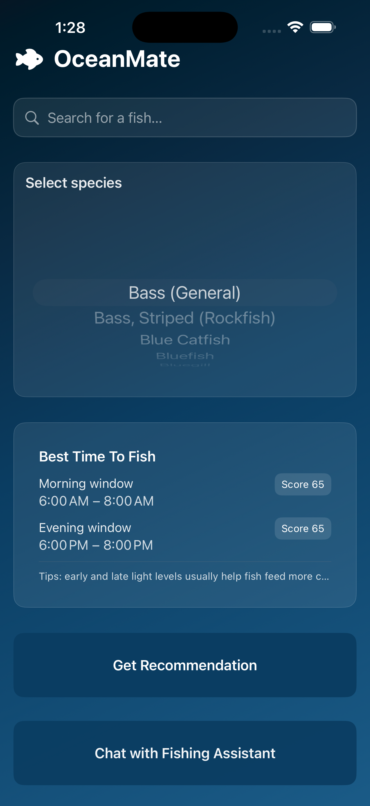
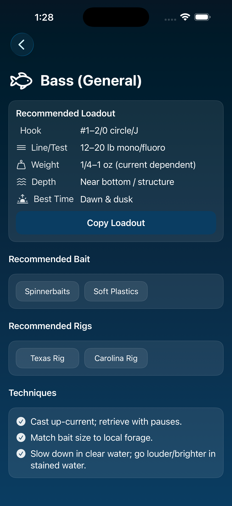

# OceanMate-iOS 🌊🎣

OceanMate is a SwiftUI-based iOS application that provides species-specific fishing recommendations through a clean, modern interface. The app combines structured fishing knowledge with an AI-powered chat assistant to help anglers quickly determine optimal rigs, bait, and techniques.

The project was built with a focus on modular architecture, real-world API integration, and production-style SwiftUI design.

---

## Features

- 🔍 **Species Search & Selection**  
  Browse and select fish species to receive tailored recommendations.

- 🎣 **Rig & Technique Recommendations**  
  View suggested hooks, line strength, weights, depth, bait, rigs, and fishing techniques per species.

- ⏰ **Best Time to Fish Windows**  
  Displays optimal morning and evening fishing windows with scoring indicators.

- 📋 **Copy Loadout**  
  One-tap copy of recommended setups for quick reference on the water.

- 💬 **AI Fishing Assistant**  
  Built-in chat-style assistant for natural language fishing questions (designed for OpenAI integration).

- 🌙 **Dark Mode First UI**  
  Custom theming optimized for low-light and outdoor use.

---

## Screenshots

  
  

---

## Tech Stack

- **Language:** Swift  
- **Framework:** SwiftUI  
- **Architecture:** MVVM-inspired, service-oriented  
- **APIs:** OpenAI API (chat assistant), mock data layer for offline use  
- **Platform:** iOS 17+

---

## Architecture Overview

The app is organized to mirror production iOS projects, with clear separation of concerns:

This structure makes it easy to extend the app with additional APIs (weather, location, tides) without coupling UI and business logic.

---

## Why I Built This

OceanMate was built to combine a personal interest in fishing with hands-on iOS development and applied AI. The goal was to design an app that feels practical and polished, while experimenting with real-world API usage, clean architecture, and scalable SwiftUI patterns.

---

## Roadmap

Planned future improvements include:
- 🌦 Weather- and tide-aware recommendations
- 📍 Location-based fishing insights
- ⭐ Saved rigs and favorite species
- 🤖 Improved prompt tuning for higher-quality AI responses
- ☁️ Persistence and user profiles

---

## Getting Started

1. Clone the repository  
2. Open the project in Xcode  
3. (Optional) Add your OpenAI API key to enable chat functionality  
4. Build and run on an iOS 17+ simulator or device

---

## License

MIT
